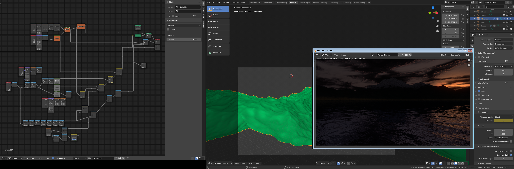
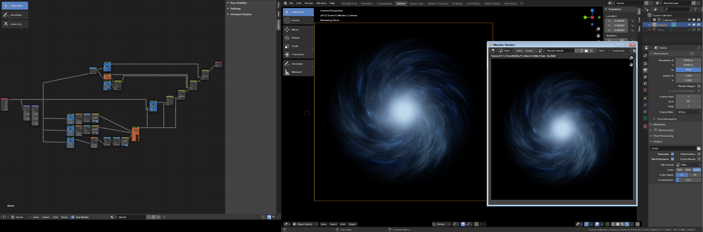

# Generative Blender

Various generative scenes purely done with shaders, composers and generative modifers in Blender 2.8

## Scenes
 
| Scene | Preview |
| :----- | :------ |
| [Planets/Ground](https://github.com/Rideu/generative-blender/tree/master/Planets/Ground) |  |
| [Planets/Planetator](https://github.com/Rideu/generative-blender/tree/master/Planets/Planetator) |  |
| [Space/Galaxy](https://github.com/Rideu/generative-blender/tree/master/Space/Galaxy) |  |
| [Space/Nebulator](https://github.com/Rideu/generative-blender/tree/master/Space/Nebulator) |  |